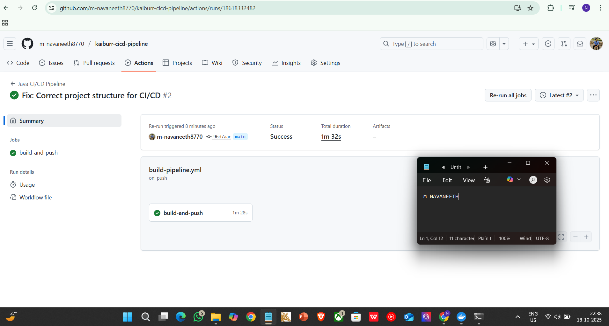
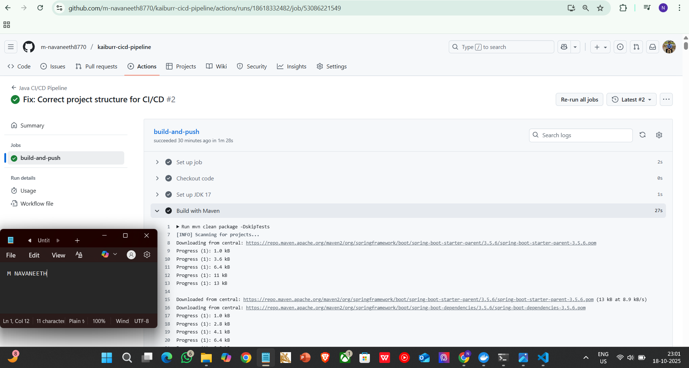
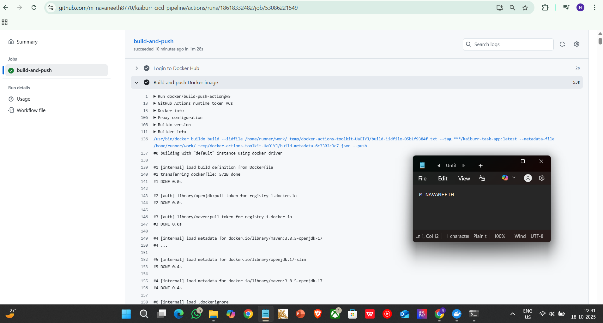
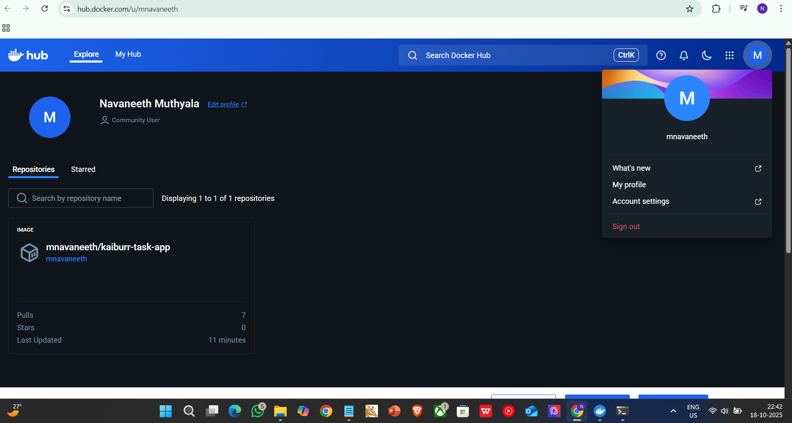

# Kaiburr Assessment - Task 4: Automated CI/CD Pipeline

## 🚀 Project Overview

This repository demonstrates a complete, automated Continuous Integration and Continuous Delivery (CI/CD) pipeline for the Java backend application. This project fulfills all requirements for Task 4 by automating the build and containerization process, ensuring code quality and rapid delivery.

The pipeline is designed to trigger automatically on every push to the `main` branch, streamlining the development workflow from source code to a deployable artifact in a container registry.

---

## 🛠️ CI/CD Tooling Selection

For this task, **GitHub Actions** was chosen as the primary CI/CD tool. This decision was based on several key advantages that align with modern DevOps best practices:

* **Native Integration:** As the code is hosted on GitHub, using GitHub Actions provides a seamless, all-in-one platform for source control and automation. The pipeline configuration lives directly within the `.github/workflows` directory, making it version-controlled and transparent.
* **Managed Infrastructure:** GitHub Actions runs on cloud-hosted virtual machines (runners), eliminating the need to set up, manage, or maintain separate CI/CD servers like Jenkins.
* **Rich Ecosystem:** It offers a vast marketplace of pre-built "Actions" that simplify complex tasks. In this pipeline, we leverage official actions like `actions/checkout`, `actions/setup-java`, and the powerful `docker/build-push-action` to handle code checkout, environment setup, and Docker image publication with minimal custom scripting.
* **Secure Credential Management:** GitHub Secrets provide a secure and robust way to store sensitive information like the `DOCKERHUB_TOKEN`, ensuring that credentials are never exposed in the source code.

---

## ⚙️ Automated Pipeline Workflow

The pipeline consists of a single job that executes a series of sequential steps to build and publish the application:

1.  **Checkout Code:** The workflow begins by checking out the latest commit from the `main` branch onto the GitHub runner.
2.  **Set Up Environment:** It provisions a clean environment with the required Java Development Kit (JDK 17) to ensure a consistent build environment.
3.  **Compile & Package (CI):** This is the **Continuous Integration** step. The pipeline executes `mvn clean package`, which compiles the Java source code, runs any unit tests (skipped in this config for speed), and packages the application into an executable `.jar` file. A failure in this step immediately stops the pipeline and reports an error.
4.  **Authenticate with Registry:** The pipeline securely logs in to Docker Hub using the `DOCKERHUB_USERNAME` and `DOCKERHUB_TOKEN` secrets.
5.  **Build & Push Docker Image (CD):** This is the **Continuous Delivery** step. Using the project's `Dockerfile`, it builds a new Docker image, tags it, and pushes the final artifact to the specified Docker Hub repository (`mnavaneeth/kaiburr-task-app`).

---

## 📸 Evidence of a Successful Pipeline Run

The following screenshots provide definitive proof of a successful, end-to-end pipeline execution.

### 1. Pipeline Success Summary
This screenshot shows the main summary view in the "Actions" tab. The green checkmark confirms that the entire workflow, triggered by the commit "Fix: Correct project structure for CI/CD", completed successfully in 1 minute and 28 seconds.

### 2. Successful Maven Build Step
Drilling down into the job, this log output confirms that the "Build with Maven" step passed, successfully compiling the code and creating the `.jar` artifact.

### 3. Successful Docker Image Push
This log output from the "Build and push Docker image" step shows the successful execution of the Docker build process and the final push to the registry.

### 4. Final Artifact on Docker Hub
This screenshot of my Docker Hub profile (`mnavaneeth`) confirms the final result: the `mnavaneeth/kaiburr-task-app` image was successfully published and is now available for deployment.

