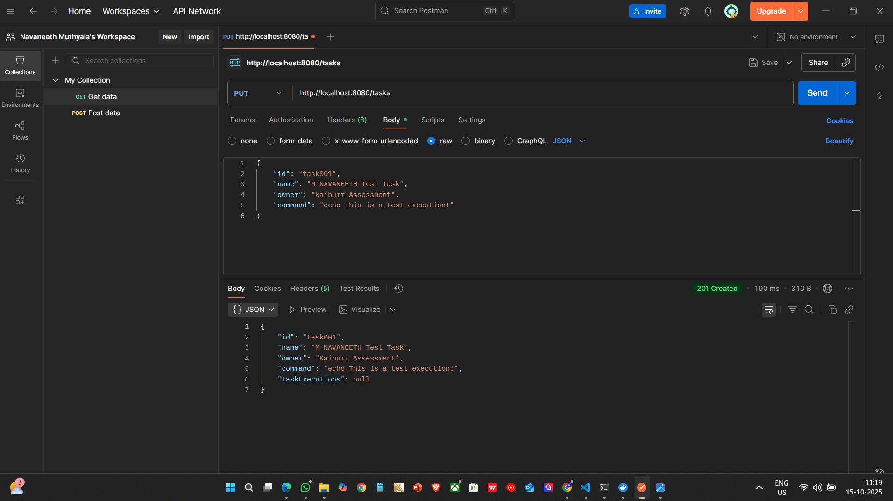
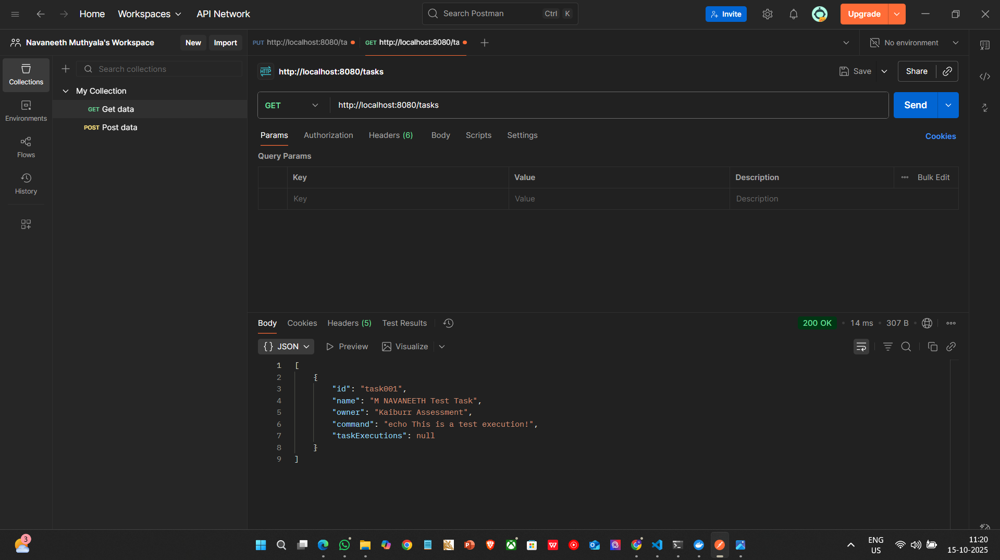
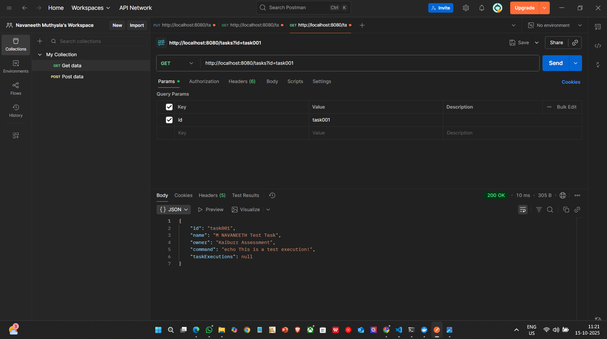
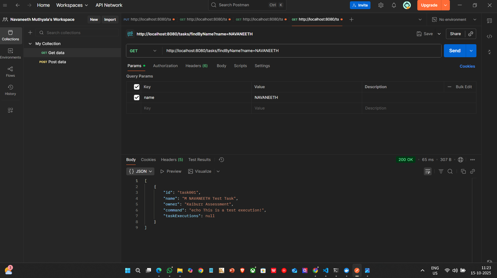
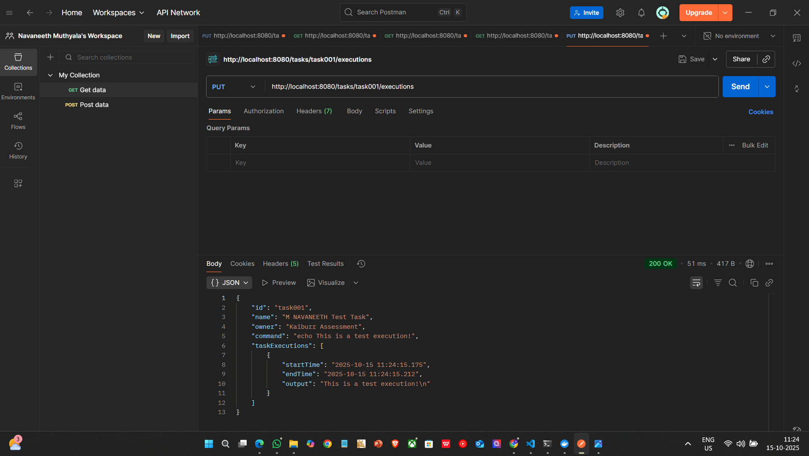
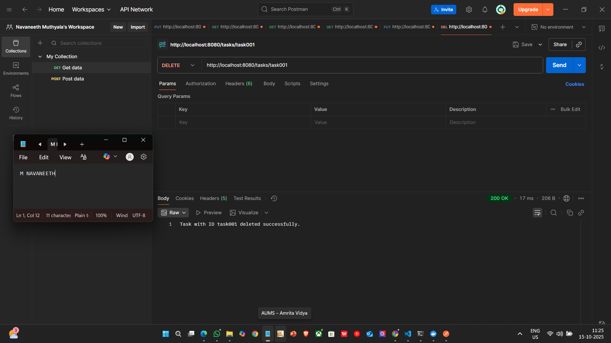
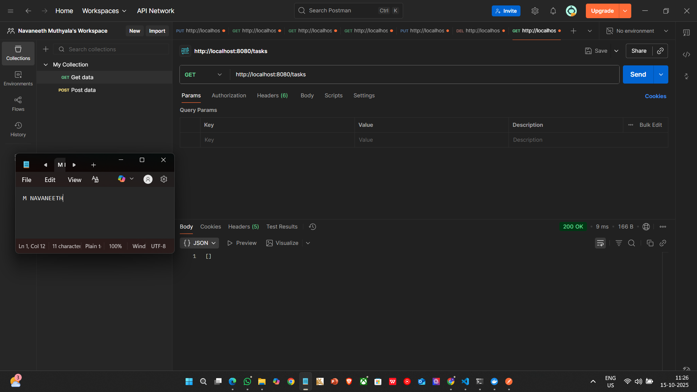

# Kaiburr Assessment - Task 1: Java REST API

## Project Overview

This repository contains the source code for a robust Java Spring Boot application built to fulfill the requirements of Task 1 of the Kaiburr assessment. The application exposes a RESTful API for managing "task" objects, which represent shell commands. It supports full CRUD (Create, Read, Update, Delete) operations, as well as advanced search and execution capabilities. All data is persisted in a MongoDB database.

The project is built with a focus on clean code, adherence to REST principles, and clear documentation.

---

## Core Features Implemented

* **Task Management:** Full lifecycle management of task objects.
* **Database Integration:** Seamlessly stores and retrieves data from a MongoDB database.
* **Search Functionality:** Endpoint to find tasks based on a partial or full name match.
* **Command Execution:** An endpoint to trigger the shell command associated with a task and record the execution details, including start/end times and output.

---

## Prerequisites

To build and run this application locally, you will need the following software installed:
* Java 17 or later
* Apache Maven
* Docker (for running the required MongoDB instance)
* An API Client (e.g., Postman) for testing the endpoints.

---

## Step-by-Step Execution Guide

### 1. Clone the Repository
Open your terminal and clone the project from GitHub:
```bash
git clone [https://github.com/m-navaneeth8770/kaiburr-java-api-task.git](https://github.com/m-navaneeth8770/kaiburr-java-api-task.git)
cd kaiburr-java-api-task
```

### 2. Start the MongoDB Database
This project requires a running MongoDB instance. The easiest way to start one is by using the official Docker image:
```bash
docker run -d --name kaiburr-mongo -p 27017:27017 mongo
```

### 3. Run the Application
Use the included Maven wrapper to compile and run the Spring Boot application:
```bash
mvn spring-boot:run
```
The API server will start on `http://localhost:8080`, and it will automatically connect to the MongoDB container.

---

## API Testing Showcase

The following section provides a comprehensive walkthrough of the API's functionality. Each screenshot demonstrates a successful request and response cycle, verifying that all requirements of the assessment have been met. Each screenshot includes my name and the system timestamp to ensure authenticity.

### 1. Creating a New Task (`1-create-task.png`)
A `PUT` request to the `/tasks` endpoint successfully creates a new task object, returning a `201 Created` status and the newly created resource.



### 2. Retrieving All Tasks (`2-get-task.png`)
A `GET` request to the base `/tasks` endpoint returns a JSON array containing all tasks currently stored in the database.



### 3. Retrieving a Single Task by ID (`3-get-task_id.png`)
A `GET` request with an `id` query parameter (`/tasks?id=...`) correctly fetches and returns the specific task object.



### 4. Finding a Task by Name (`4-find-task.png`)
A `GET` request to `/tasks/findByName` with a `name` parameter successfully finds and returns all tasks whose names contain the specified string.



### 5. Executing a Task (`5-execute-task.png`)
A `PUT` request to the `/tasks/{id}/executions` endpoint triggers the task's command. The system records the `startTime`, `endTime`, and the command's `output`, saving it back to the task object.



### 6. Deleting a Task (`6-delete-task.png`)
A `DELETE` request to `/tasks/{id}` successfully removes the specified task from the database and returns a confirmation message.



### 7. Final Verification (`7-return-empty-array.png`)
To confirm the `DELETE` operation was successful, a final `GET` request is made to `/tasks`. The API correctly returns an empty array, verifying that the task was permanently removed from the database.

